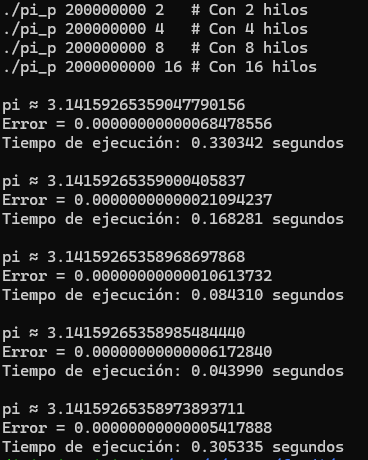

Pi  

1.  
gcc -o pi_s pi.c -lm    

2.  
gcc pi_s.c -o pi_s -lm  

Con hilos   
1.  
gcc -o pi_p pi_p.c -lpthread -lm    

2. 
./pi_p 200000000 1   # Versión paralela con 1 hilo  
./pi_p 200000000 2   # Con 2 hilos  
./pi_p 200000000 4   # Con 4 hilos  
./pi_p 200000000 8   # Con 8 hilos  

Resultados: 

  

| N (Hilos) | Tₚ (segundos) | Speedup (Tₛ/Tₚ) | Eficiencia (Speedup/N) |    
| :-------: | :-----------: | :-------------: | :--------------------: |    
|     1     |    0.330342   |       1.00      |          1.00          |    
|     2     |    0.168281   |       1.96      |          0.98          |    
|     4     |    0.084310   |       3.92      |          0.98          |    
|     8     |    0.043990   |       7.51      |          0.94          |    

Speedup 
8 |                 *   
7 |                *    
6 |              *  
5 |            *    
4 |          *  
3 | 
2 |      *  
1 |*                         
0 +---------------------------------    
   1   2   4   8    
          N (Hilos) 

Fibonacci   

1. gcc -o fibonacci fibonacci.c -lpthread   

2. ./fibonacci 15   
    